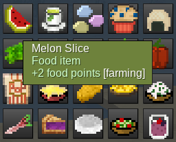

# Tooltips Eatable [`tt_eatable`]

This is an addition to the [tt](https://codeberg.org/Wuzzy/minetest_tt)

## Description

Displays saturation points for food, provided that the food item has the eatable group specified
